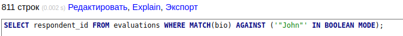
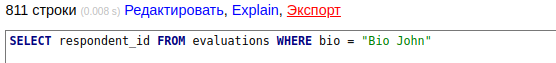

# Project PHP 8 with Composer

## Requirements
- PHP 8.*
- Composer
- Docker Compose

## Getting Started
Before starting work, make sure to import the 'evaluations.sql' dump using Adminer at localhost:8080.

Database connection details are stored in the .env file.

## Description
The project utilizes PHP 8 and Composer. It includes classes for solving tasks and SQL queries described within class functions.

## Optimization
The search speed results using a regular WHERE query and using index-based search are provided below. The test was conducted on approximately 16800 records.

| Search Method                    | Execution Time |
|---------------------------------|----------------|
| Regular WHERE Query              | 0.008 sec      |
| Full-text Index Search           | 0.002 sec      |

These results demonstrate significant acceleration of the search process when using a full-text index compared to a regular WHERE query.
